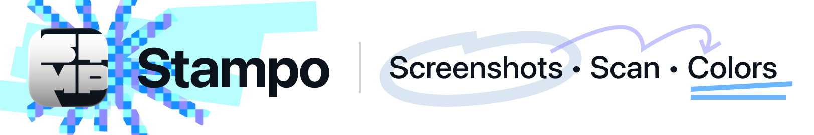
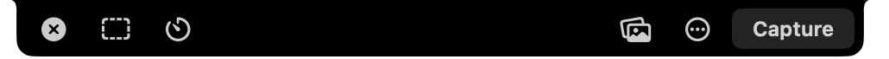
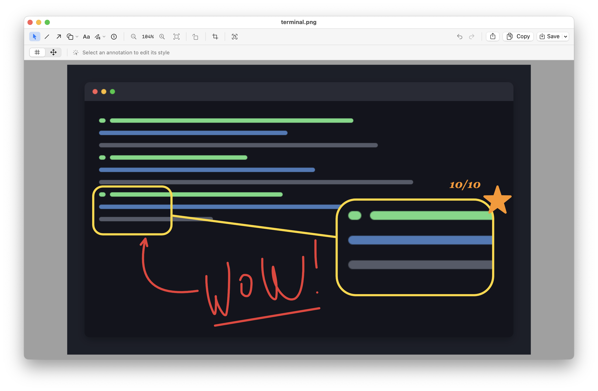
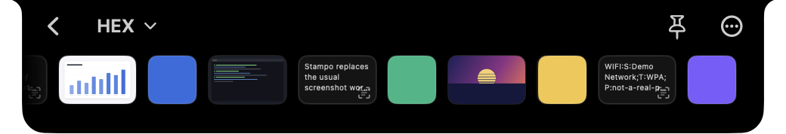

Screenshot, text capture, and color picker for any Mac. The panel lives at the notch (or at the center of the menu bar on screens without one) — no Dock icon, minimal menu bar presence.

---

## What is Stampo

Stampo replaces the usual screenshot workflow with a panel that opens when you click the notch. From the panel you can take area, window, or fullscreen screenshots, mark them up in the built-in editor, scan any region for text and QR/barcodes, pick colors, and browse your recent captures in the archive.

## Requirements

- macOS 15.7 or later

> **Note:** Stampo is designed around the notch, but works on any Mac. On screens without a notch the panel is drawn at the top center of the menu bar; its style and size are configurable in **Settings → General**.

## Installation

### Download the DMG

1. Download the latest `Stampo-<version>.dmg` from the [Releases](https://github.com/git-webuser/Stampo/releases) page.
2. Open the DMG and drag **Stampo.app** to your **Applications** folder.
3. Open Stampo from Applications. macOS blocks this first attempt and says *"Stampo can't be opened because Apple cannot check it for malicious software."* — expected, since the app isn't notarized yet.
4. Open **System Settings → Privacy & Security** and scroll down to the message about Stampo being blocked.
5. Click **Open Anyway**, then confirm. Stampo starts, and won't ask again.

Control-clicking the app and choosing **Open** used to skip those last two steps.
macOS 15 removed that shortcut and Stampo requires macOS 15.7 or later, so
**Open Anyway** is the way through.

### Homebrew

If you're comfortable with the terminal, this route skips the block entirely —
`--no-quarantine` keeps macOS from flagging the download, so Stampo opens on the
first double-click with nothing to approve:

```bash
brew tap git-webuser/stampo https://github.com/git-webuser/Stampo
brew install --cask --no-quarantine stampo
```

Update later with `brew upgrade --cask stampo`.

## Permissions

Stampo needs a single permission to work. You'll be prompted to grant it on first launch, or you can open System Settings manually.

| Permission | Why it's needed |
|---|---|
| **Screen Recording** | Required to take screenshots and sample colors from the screen. |

To grant it: **System Settings → Privacy & Security → Screen Recording** → enable Stampo.

Clicking the notch and global hotkeys work without any permission — they use standard AppKit event monitors and a Carbon hotkey, so there's no Input Monitoring prompt.

## How to use



- **Click the notch** (or the top center of the menu bar on screens without one) to open the panel. Click it again to close, or press `⌃⌥⌘N`.
- **Click a capture mode** to start a screenshot, scan, or color pick.
- **Click the archive icon** (stack icon) to browse recent captures.
- All screenshots are saved to your chosen folder (default: `~/Pictures/Stampo`).

## Scan (text & codes)

Select an area of the screen and Stampo reads it in a single pass: every QR/barcode payload plus all readable text. The language is detected for you — recognition is tuned toward English and Russian, and reads other languages macOS knows as well, just less surely. Everything found is copied to the clipboard in visual order, and each finding is added to the archive as a text entry. Nothing is saved to disk, and code payloads are treated strictly as inert text — never opened, linkified, or fetched. Start it from the capture-mode menu in the panel or with `⌃⌥⌘S`.

The recognized text comes back as paragraphs, not as the lines the original layout happened to wrap it into: a hyphen at a wrap is kept (so `кто-то` survives), a soft hyphen is dropped, and a blank line or a change of type size starts a new paragraph. Barcode payloads always stay on a line of their own.

While the selection overlay is up, **⌥** and **⌃** switch what happens on release, and the frame says which mode is armed:

- **⌥ — Keep line breaks.** An orange frame. Every break the original layout produced survives, for the blocks where the breaks are the content: verse, code, one column of a table.
- **⌃ — Translate.** A blue frame. The recognized text is translated and added to the archive alongside the original. Barcode payloads are left alone.

Both are toggles, not keys to hold: press once to arm, again to disarm. They are alternatives — arming one disarms the other, since translating rejoins the lines that ⌥ exists to keep. Pressing them is what counts, so releasing the `⌃⌥⌘S` chord that opened the overlay changes nothing.

## Translate

Recognized text can be translated on the spot, into any language macOS offers a pack for. Stampo reads the source language off the text itself, so with two languages set up there is nothing to choose: whatever the text is in, the other one is the answer. Add a third and the destination stops following from the source, so Translate opens a list of your languages instead.

Three ways in:

- **Right-click a text entry in the archive → Translate.** The translation arrives as a new entry above it. Past two languages this is a submenu — every language is listed, including the one the text looks like, since detection is right most of the time rather than all of it.
- **`⌃⌥⌘T`** translates whatever text is on the clipboard — select anywhere, press `⌘C`, then the hotkey. The archive opens with the result.
- **`⌃` while framing a scan** (see above), for text that cannot be selected at all: a picture, a PDF without a text layer, a video, another machine over VNC.

The result is an ordinary archive entry: click to copy, drag out, share, remove. Text that is already in the target language is reported rather than filed, so the archive does not fill up with copies of itself.

Translation runs entirely on your Mac, through the translator built into macOS. Nothing is uploaded — see [Privacy & Security](#privacy--security).

### Language packs

macOS ships no translation packs installed, and downloads them itself the first time one is needed. Packs are per language, not per pair, so each language you add carries its own download and its own row.

Open **Settings → Archive → Translation**: each row reports whether its pack is present and offers to install it, macOS asks for confirmation, and after that translation works offline and never asks again. **Add language…** picks a new one from everything macOS supports. Asking to translate with fewer than two languages installed opens a window that explains translation and sets it up on the spot, rather than sending you off to find the setting.

## Markup Editor



Click the post-capture thumbnail (or right-click a screenshot in the archive → **Edit**) to open the built-in editor: lines, arrows, rectangles, rounded rectangles, ovals, triangles, polygons, stars, speech bubbles, freehand drawing, numbered steps, text labels, loupes, and blur/pixelate regions, with full undo/redo (`⌘Z` / `⇧⌘Z`). Shapes live behind one toolbar button with a popover, as do the drawing brushes. The second toolbar row shows the settings for the active tool — colors, solid/dashed line styles, arrow route (straight, curved, or elbow) chosen independently of the stroke, arrowheads at the start, end, or both endpoints, text formatting (bold, italic, underline, strikethrough, shadow, a light/dark/none background plate, and left/center/right alignment), loupe shape and mode, and controls for line thickness, brush size, text size, marker size, fill opacity (0–100%), magnification, and blur/pixelate intensity. On narrow windows the toolbar buttons collapse from label to icon so nothing wraps.

- **Save** (`⌘S`) always writes a **new file** to your save folder — the original screenshot is never modified — and the result appears in the archive.
- **Copy** (`⌘C`) puts the marked-up image on the clipboard at the original pixel resolution.
- Rotate the whole image in 90° steps with the toolbar buttons.
- **Crop** the image: drag a frame with corner/edge handles (or type an exact **W × H** in the toolbar), then **Apply** (**Return**) or **Cancel** (**Esc**). The frame shows a rule-of-thirds grid, nudges with the arrow keys (`⇧` 10 px, `⌥⇧` 50 px), rotates with the image, and stays within the picture; cropping is undoable.
- **Share** hands the marked-up image to the system share sheet — Mail, Messages, AirDrop, or anything else you have installed. It exports a real file named after the document in your configured format, and never saves: an unsaved edit stays unsaved.
- **Scan** a region: click the Scan button (next to Crop), drag over an area, and every QR/barcode payload and all readable text is copied to the clipboard and added to the archive. The **Line Breaks** control in the second toolbar row switches between paragraphs (the default) and the raw line-by-line text.
- Hover any toolbar control for a tooltip describing it.
- Double-click a text label or step marker to edit it; inside a text label, **Return** commits and **⇧Return** starts a new line. New step markers auto-number from the highest numeric label (labels can be any text, e.g. `1.1` or `4.12`).
- Blur/pixelate always sits beneath the other annotations, so arrows, text, and shapes stay crisp on top of a redacted region.
- The **Loupe** magnifies a region — as an oval or a rounded rectangle, and either in place or as a **callout** (a source marker joined by a connector to a detached magnifier you can position and resize independently). It can reveal either the original image or the redacted result beneath it.
- **Arrows can bind to shapes.** Drop an endpoint on a shape and it attaches to that shape's geometry, then follows it as the shape is moved or resized. Anchor points light up while you draw, an outline magnet catches the edge, and a center connector attaches to the shape as a whole. Elbow arrows route along axes with rounded corners and one slider per leg; hold **Shift** to force a straight line.
- The **Drawing** tool combines an opaque pen and a wide translucent marker. The separate **Eraser** tool partially removes their strokes without touching shapes, text, or redactions. One drawing or erasing gesture is one undo step.
- Press **⌘D** to duplicate the selected annotation with a **40 × 40 px** offset, or hold **Option** while dragging any annotation to duplicate and move it in one gesture.
- Switch tools from the keyboard: **V** Select, **L** Line, **A** Arrow, **R** Rectangle, **O** Oval, **T** Text, **P** Drawing, **E** Eraser, **B** Blur, **S** Step, and **M** Loupe. Tool shortcuts pause while editing text or typing in a field.
- Format the selected or inline-edited text with **⌘B** Bold, **⌘I** Italic, **⌘U** Underline, **⇧⌘X** Strikethrough, and **⇧⌘H** Shadow. With no selection, these shortcuts configure the next text label.
- Press **Delete** / **Backspace** to remove the selected annotation. **Esc** cancels the active mode or returns the active tool to the cursor; use **⌘W** to close the editor.
- Hold **Shift** to snap lines and arrows to 45° or draw square/circular shapes; use arrow keys to nudge the selected annotation by 1 px (`⇧`: 10 px, `⌥⇧`: 50 px).
- Pinch to zoom, and pan a zoomed image by dragging an empty area (or holding **Space** while dragging); use `⌘−`, `⌘+`, or `⌘0` to zoom out, zoom in, or fit the image.
- Prefer the old behavior? Set **Settings → General → On thumbnail click** to *Open preview*.

## Hotkeys

| Action | Default shortcut |
|---|---|
| Toggle panel | `⌃⌥⌘N` |
| Selection screenshot | `⌃⌥⌘R` |
| Fullscreen screenshot | `⌃⌥⌘B` |
| Window screenshot | `⌃⌥⌘G` |
| Pick color | `⌃⌥⌘C` |
| Scan (text & codes) | `⌃⌥⌘S` |
| Translate clipboard | `⌃⌥⌘T` |
| Pin latest capture | `⌃⌥⌘L` |
| Pin panel (collect files) | `⌃⌥⌘P` |
| Share last item | `⌃⌥⌘D` |

Every hotkey is fully customizable in **Settings → Hotkeys** — record a new combination, restore the default, or clear it to disable the action.

### `⇥` — step the list in front of you

Wherever Stampo offers a list in a header, **`⇥`** moves to the next one and **`⇧⇥`** back. It is the same key on all four surfaces: the notation in the color picker and in the archive, the language in the translator and on the scan frame. `F` still steps the notation in the color picker, as it always did.

It is one key rather than four because it is one idea, and it is `⇥` because there is nothing to memorize. Turn it off in **Settings → Hotkeys → Element Controls → Cycle Color or Language**.

While the panel is open, `⇥` is only claimed with the pointer resting on the panel — a registered key is taken from every app on the machine, and a pinned panel must not eat `⇥` in whatever you are typing in.

## Where screenshots are saved

By default, screenshots are saved to **~/Pictures/Stampo**. You can change the save folder in **Settings → Capture → Save Location**.

File names follow one of four presets, selectable in **Settings → Capture**: compact `Jan·05-14·30·22` (default), ISO `2026-01-05 14-30-22`, numbered `2026-01-05 #1`, or dense `20260105-143022`. The file format is PNG, JPG, or TIFF.

## Archive

The archive shows recent screenshots, color swatches, and scanned or translated text — and it's also a drop target for files.



Entries stay in the order they were captured, newest first, and the row scrolls once it fills up. The header switches the notation color swatches are copied in — HEX, RGB, HSL, HSB, or CMYK — from the menu, or with `⇥` while the pointer is on the panel.

- **Click** a screenshot to open it.
- **Right-click** for options: Edit, Open, Pin to Screen, Show in Finder, Copy, Share, Select Items, Move to Trash.
- **X button** (on hover) removes the item from the archive — the file is not deleted. The same is on the right-click menu.
- **Drag** a screenshot out of the archive to copy it anywhere.

### Select several at once

Hold **⌘** and click any cell to start picking. Checkboxes appear on every entry, the ones you pick wear a ring, and a button showing the count joins the header. You can also start from **Select Items** in a cell's right-click menu or in the panel's **⋯** menu.

The count button opens what the selection can do: **Select All**, **Copy**, **Share**, and **Remove from archive**. The same four are on the right-click menu of any picked cell, so a pile of ten is reachable from whichever one the pointer is already over. Copy, Share and Remove each end the mode — they are what you turned it on for. Select All does not, and **⌘A** does the same thing from the keyboard while the mode is running.

- **Stacks are picked member by member.** A stack's own checkbox is three-state: empty, partly filled, or full. Clicking it fills the whole stack unless it is already full, in which case it empties. The count is files, not entries, so a picked stack of twenty reads as twenty — the same number Copy, Share and a drag will actually carry.
- **Drag any picked cell** and the whole selection goes with it. Dragging an *unpicked* cell in the mode does nothing at all, deliberately: a slipped drag must not cost you a selection you were halfway through building.
- **Esc and the back chevron** step out one layer per press — collapse an open stack, leave the mode, leave the archive. They differ only on the last one, where Esc closes the panel and the chevron returns to the main panel.

Nothing here is remembered. The archive always reopens in the plain grid with nothing picked.

### Collect files

Drop files onto the open archive and they gather into a **stack** — a temporary pile you fill from several windows, then drag out all at once into a destination folder. Files are grouped by their source folder, so dropping from Downloads and Desktop makes two separate stacks, each labeled with its folder name. Drag a stack out to move everything it holds in one gesture; the stack clears once the files land. The archive keeps references to the originals, never copies, so nothing is duplicated on disk while they sit there.

Press `⌃⌥⌘P` to open the archive straight into collect mode — the panel pins itself so it survives the mouse-down that starts a drag from another window; press it again to close.

Every file in the archive shows a real preview, whatever it is: PDFs, videos, Pages documents and anything else macOS can render appear as their content rather than a generic document icon. Files with nothing to preview fall back to their file-type icon.

## Pin to Screen

Keep a screenshot floating above all windows while you work — handy for copying data into another app or comparing against a reference. Right-click a screenshot in the archive or on the post-capture thumbnail → **Pin to Screen**, or press `⌃⌥⌘L` to pin the last capture.

Pinned screenshots stay on top of everything, follow you across Spaces, and never steal focus. Drag a pin by its body to move it, resize it from the edges (proportions are kept), and close it with the **X** button, a **double-click**, or **Esc** while hovering it. Right-click a pin for Copy, Edit, Show in Finder, Unpin, or Close All Pins.

## Accessibility

- **The shortcut recorder** works from the keyboard. Tab to it, press Space or Return to arm it, type the combination, or press Esc to back out. (Tab reaches it once **System Settings → Keyboard → Keyboard navigation** is on, as with any non-text control on macOS.)
- **Increase Contrast** (System Settings → Accessibility → Display) is honoured: the panel's hover, pressed and active states come back stronger instead of separating by a few percent of alpha.
- **Esc** closes the welcome window, and cancels the panel, the colour picker, a capture overlay or a hovered pin.
- Not there yet: **VoiceOver** support, **Reduce Motion**, and walking the editor's toolbar with Tab — its buttons answer to their own shortcuts instead (V, L, A, R, O, T, P, E, B, S, M, plus `⌘Z`, `⌘±`, `⌘0`).

## Known Limitations

- **Window screenshot** without a timer uses the frontmost window at the moment of capture. If another window becomes active during the hotkey press, it may be captured instead.
- **Cursor behavior** in the capture overlays relies on a private macOS API (`CGSSetConnectionProperty`), resolved at runtime. If a future macOS removes it, Stampo keeps working — only the cursor override while another app is frontmost is skipped.

## Privacy & Security

Stampo does not upload screenshots, sampled colors, or any other data. The full account — including how to report a vulnerability — is in [SECURITY.md](SECURITY.md).

- **One optional network request**: once a day Stampo asks the GitHub API
  for the latest release version to offer an update notification. It sends
  nothing beyond a standard HTTPS request and can be turned off in
  **Settings → General → Updates**. There are no other network requests.
- **Share** is the one way an image leaves your Mac, and only when you ask:
  Stampo writes the image to a temporary file and hands it to the macOS
  service you pick from the sheet. Whatever that service then does with it is
  between you and that app — Stampo itself sends nothing.
- **Translation is on-device.** It uses the translator built into macOS, with
  a language pack downloaded once by the system. The text being translated
  never leaves your Mac, and no translation service is contacted. The
  languages on offer are therefore whichever ones macOS itself can translate
  offline, rather than everything a cloud API would list.
- No analytics or telemetry.
- No crash reporting.
- All captures stay on your Mac.

### Why Stampo is not sandboxed

Stampo runs with the **App Sandbox disabled** (Hardened Runtime is enabled). This is an architectural requirement, not an oversight: the app monitors mouse clicks anywhere on screen (to detect notch clicks), registers global hotkeys, and shells out to the system `screencapture` tool — none of which work inside the sandbox.

How the input pieces actually work — none of them require Input Monitoring, and none read your keystrokes:

- **Notch click** — a pair of standard AppKit mouse monitors (`addGlobalMonitorForEvents` / `addLocalMonitorForEvents`) that observe left mouse-down location only. They cannot modify or block events, and see nothing beyond "was the notch area clicked".
- **Global hotkeys** — registered with Carbon's `RegisterEventHotKey`, so macOS only ever hands Stampo the exact combinations you assigned.
- **Esc to cancel** — a Carbon hotkey active **only while a cancellable surface is on screen** (the panel, the color picker, a capture overlay, or a hovered pin). It captures the single Esc key for that moment and is removed as soon as the surface closes. No other keystrokes are observed at any time.

Screenshots are taken with Apple's official APIs (ScreenCaptureKit and the system `screencapture` tool), saved files are accessed through security-scoped bookmarks, and diagnostic logs contain no captured content, file paths, or precise cursor positions.

## Uninstall

1. Quit Stampo.
2. Move **Stampo.app** from Applications to Trash.
3. To remove all settings and saved data:

```
~/Library/Preferences/com.hex000.Stampo.plist
~/Library/Application Support/Stampo
```

## License

MIT License. See [LICENSE](LICENSE).

---

*Stampo 0.8.1 — for macOS 15.7+*
