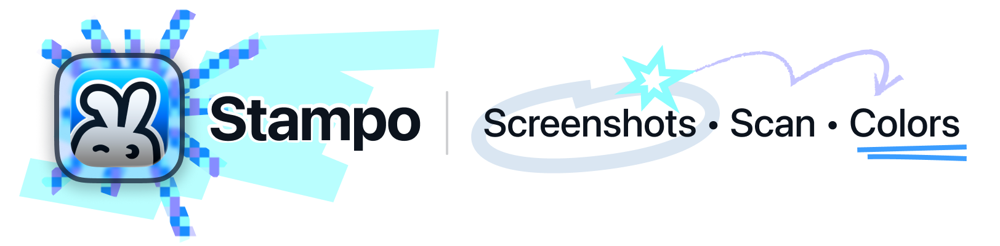
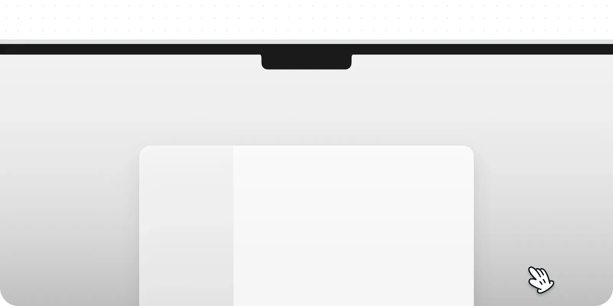
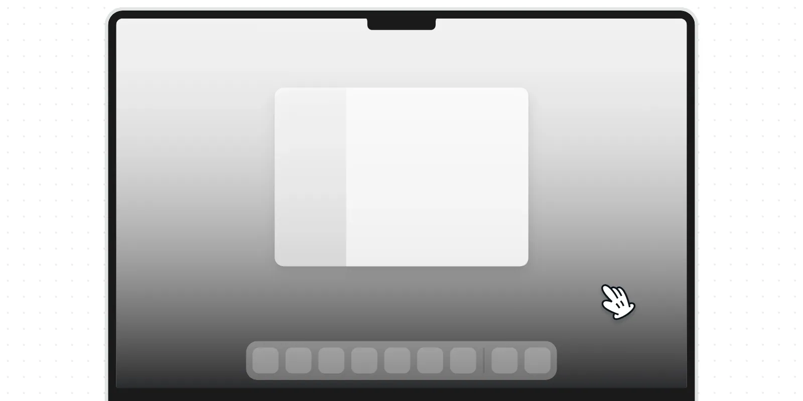
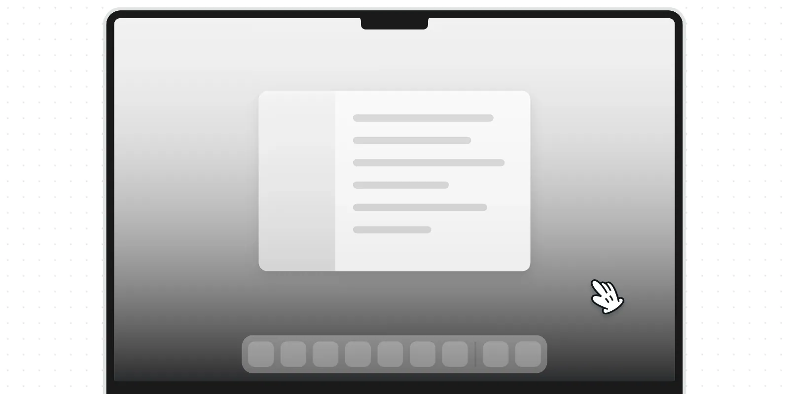
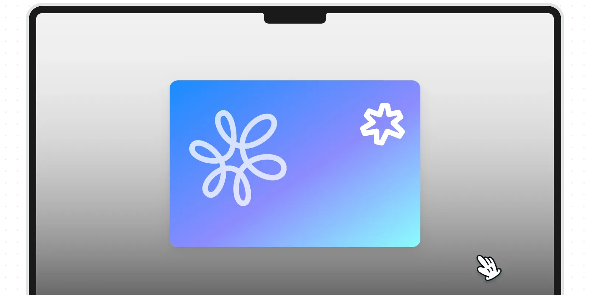

Screenshot, scan, and color picker for macOS, living in the notch. No Dock icon; on a Mac without a notch the panel sits at the top of the menu bar.

## What is Stampo

### Capture



Click the notch: an area, a window or the whole screen.

### Mark up



Arrows, shapes, text, blur — and Decor sets the shot on a page.

### Scan and translate



Text and QR codes from anywhere on screen, translated on your Mac.

### Pick colors, keep everything



Colors, scans and shots wait in the archive at the notch.

## Installation

macOS 15.7 or later.

```bash
brew tap git-webuser/stampo https://github.com/git-webuser/Stampo
brew install --cask --no-quarantine stampo
```

<details>
<summary>Or download the DMG</summary>

1. Download `Stampo-<version>.dmg` from [Releases](https://github.com/git-webuser/Stampo/releases) and drag **Stampo.app** to Applications.
2. Open it. macOS blocks the first launch: the app isn't notarized yet.
3. Go to **System Settings → Privacy & Security**, click **Open Anyway** and confirm.

</details>

## Permissions

Only **Screen Recording**, asked for on first launch. The notch click and the hotkeys need none.

## Hotkeys

| Action | Shortcut |
|---|---|
| Toggle panel | `⌃⌥⌘N` |
| Selection screenshot | `⌃⌥⌘R` |
| Fullscreen screenshot | `⌃⌥⌘B` |
| Window screenshot | `⌃⌥⌘G` |
| Pick color | `⌃⌥⌘C` |
| Scan (text & codes) | `⌃⌥⌘S` |
| Translate clipboard | `⌃⌥⌘T` |
| Pin latest capture | `⌃⌥⌘L` |
| Pin panel (collect files) | `⌃⌥⌘P` |
| Share last item | `⌃⌥⌘D` |

Change any of them in **Settings → Hotkeys**.

## More

- [User guide](MANUAL.md) — every feature in detail
- [Privacy & security](SECURITY.md)

---

*Stampo 0.9.2 — for macOS 15.7+*
